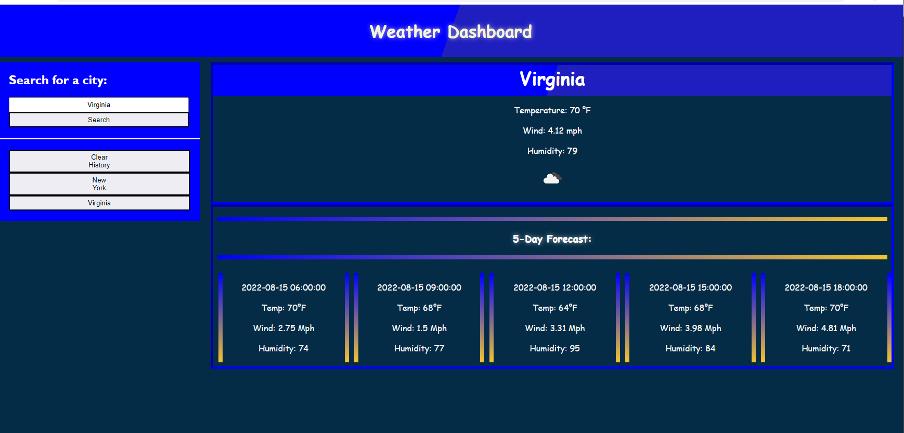

# Weather-Dashboard
Challenge 6 for UoM: 5-day weather forecast for any city 

For this weeks challenge I was tasked with creating a weather dashboard using OpenWeather One Call API. Using this data, I would then create a UI that allows a user to input data to search for a city's five day weather forecast and save the locations picked in local storage. A user could then interact with buttons created with JavaScript to look back at recent searches.   

- The motivation behind this project was to become more familiar with the OpenWeather One Call API and further develop functional user interfaces to meet a users expectations and functionality.  
 
- I built this project to advance my skills with working with APIs and creating a more welcoming environment for users to interact with.

- This project resolves around having a search feature for a user to interact with and lookup city's that the user may want to know the weather forecast for. Using this website calls on OpenWeather to get information on the current weather in these locations and displays the data on the webpage. Using local storage, we can save past searches and interact with these buttons created to re-look at a city's data when pressed.   

- Completion of this project allowed for me to become more knowledgeable on third-party APIs and completion of an online weather dashboard that keeps local storage elements for the past search history. 

# Installation
In order to install my project, you will need the following

- Git
- IDE with HTML/CSS/JS capabilities 

To start: 
Clone the repository on GitHub then open Git on your local machine. First find a location of your choice on your computer that you want the folder to be in.
- To change working directory, use the command cd followed by a folder or cd.. to move back  
- Using the command git clone and adding the cloned directory, you will have a copy of this project
- To deploy to your ide type code. 

# Usage 
The purpose of this project is to make a functional webpage that uses server-side APIs to retrive data based off of requests made to a url. With the data retrived, we are able to display a weather forcast for a city. 

# Deployed Site 
https://wixkedluck.github.io/Work-Day-Scheduler-/

